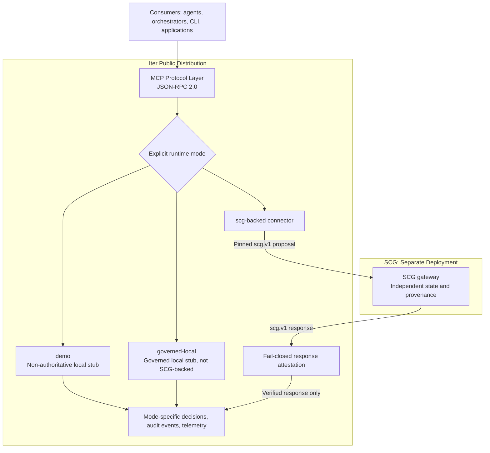

# Iter Reference Architecture

**Classification:** External-Safe  
**Version:** 1.0  
**Last Updated:** September 2026

---

## System Overview

Iter is a deterministic governance control plane that evaluates policy conditions, enforces constraints, and emits cryptographically verifiable DecisionPackets as governance evidence.

```text
Consumers (agents, orchestrators, CLI tools, applications)
                         |
                  JSON-RPC 2.0 / MCP
                         |
+------------------------v--------------------------------------+
| Iter public distribution                                     |
| MCP input validation -> explicitly selected runtime mode     |
|                                                              |
| demo: local stub, non-authoritative                           |
| governed-local: governed local stub, not SCG-backed           |
| scg-backed: connector -> response attestation -> decision     |
+-------------------|--------------^---------------------------+
                    |              |
              pinned scg.v1 proposals / responses
                    |              |
+-------------------v--------------|---------------------------+
| SCG: separate deployment, independent state and provenance   |
| Not embedded in the Iter binary                             |
+--------------------------------------------------------------+

Iter emits mode-specific decisions, audit events, and telemetry.
Only scg-backed uses the SCG service. Invalid attestations fail closed.
```

---

## Data Flow

```
┌─────────────────────────────────────────────────────────────────────────────┐
│                           REQUEST FLOW                                       │
│                                                                             │
│   Client                    Iter Server                    Output           │
│     │                            │                            │             │
│     │  1. JSON-RPC Request       │                            │             │
│     │  (tools/call)              │                            │             │
│     │ ──────────────────────────►│                            │             │
│     │                            │                            │             │
│     │                     2. Input Validation                 │             │
│     │                     3. Policy Evaluation                │             │
│     │                     4. Governance Decision              │             │
│     │                            │                            │             │
│     │                            │  5. Emit DecisionPacket    │             │
│     │                            │ ──────────────────────────►│             │
│     │                            │                            │             │
│     │                            │  6. Emit AuditEvent        │             │
│     │                            │ ──────────────────────────►│             │
│     │                            │                            │             │
│     │  7. JSON-RPC Response      │                            │             │
│     │◄──────────────────────────│                            │             │
│     │                            │                            │             │
└─────────────────────────────────────────────────────────────────────────────┘
```

---

## Mermaid Diagram (for tooling)



---

## Key Boundaries

| Boundary | What Crosses | What Does NOT Cross |
|----------|--------------|---------------------|
| MCP Protocol | JSON-RPC requests/responses, tool invocations | Internal state, raw policy inputs |
| Governance Output | DecisionPackets, AuditEvents, reason codes | Reasoning math, heuristics, weights |
| SCG service | Canonical proposals and attested responses over pinned `scg.v1` | SCG implementation crates and private internals |

---

## Security Posture

- **Fail-closed**: Unknown inputs rejected; invalid floats (NaN/Inf) cause hard errors
- **Deterministic**: Identical inputs produce byte-identical outputs
- **Auditable**: Every decision has a cryptographic checksum and reason codes
- **Sanitized**: No stack traces, internal paths, or debug info in responses

---

## Not Shown (Intentionally)

This diagram does NOT show:
- SCG (Substrate Compute Graph) internals
- Reasoning signal computation
- Proprietary invariant logic
- Performance/optimization details

SCG implementation evidence is produced in the SCG repository. Iter does not claim private-CI certification for an unavailable embedded substrate.

---

## System Invariants

### Execution-Blocking Semantics

**Failure Mode Guarantee:** Iter unavailability results in execution denial, not degraded execution.

```
┌────────────────────────────────────────────────────────────────┐
│                    FAILURE MODE BEHAVIOR                        │
├────────────────────────────────────────────────────────────────┤
│ Condition                    │ Result                          │
├──────────────────────────────┼─────────────────────────────────┤
│ Iter service unavailable     │ Consumer execution DENIED       │
│ Policy evaluation timeout    │ Consumer execution DENIED       │
│ Invalid policy state         │ Consumer execution DENIED       │
│ Identity verification failure│ Consumer execution DENIED       │
│ Network partition            │ Consumer execution DENIED       │
└────────────────────────────────────────────────────────────────┘
```

**Design Principle:** Deny-by-default is architecturally enforced. No execution path exists that bypasses governance evaluation.

**Operational Impact:**
- Iter operates as a control plane dependency, not an optional enhancement
- Consumers must implement circuit-breaker patterns for Iter availability
- High-availability deployment (multi-AZ, health-checked) is required for production use

This fail-safe posture ensures AI systems cannot operate outside governance boundaries under any failure scenario.
